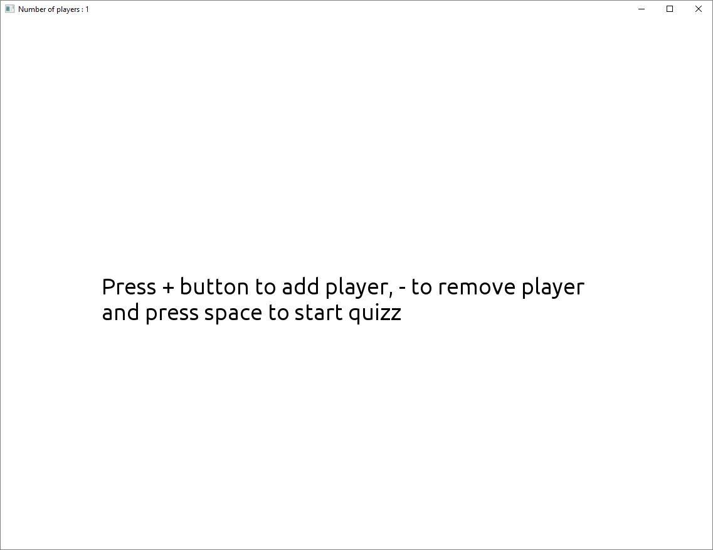
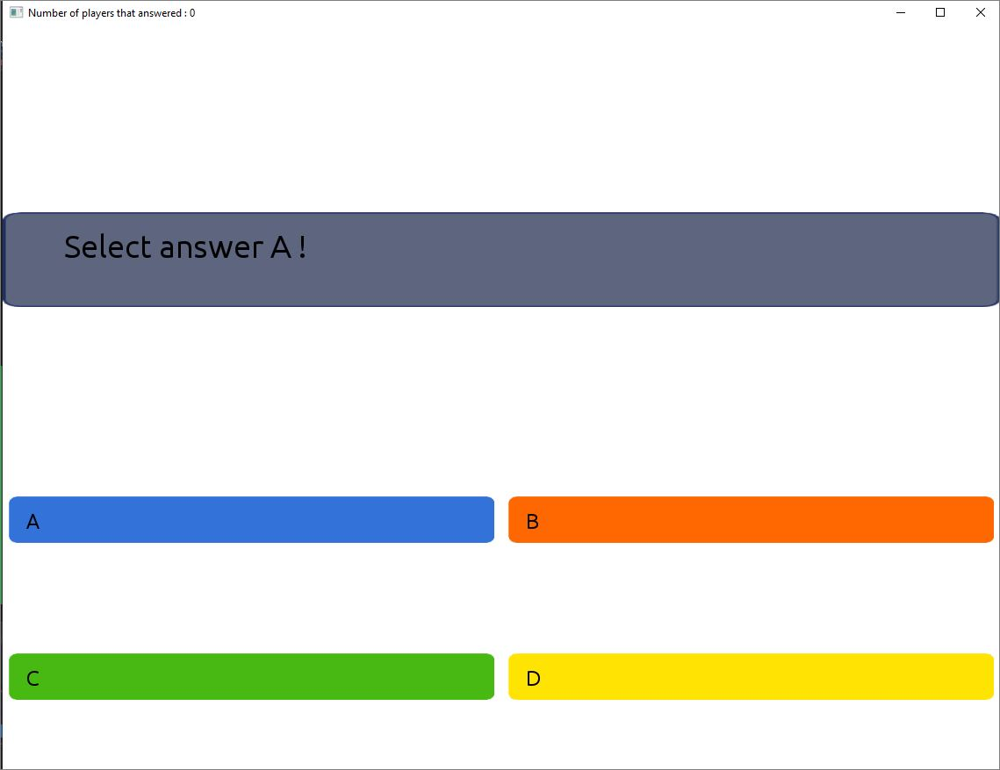
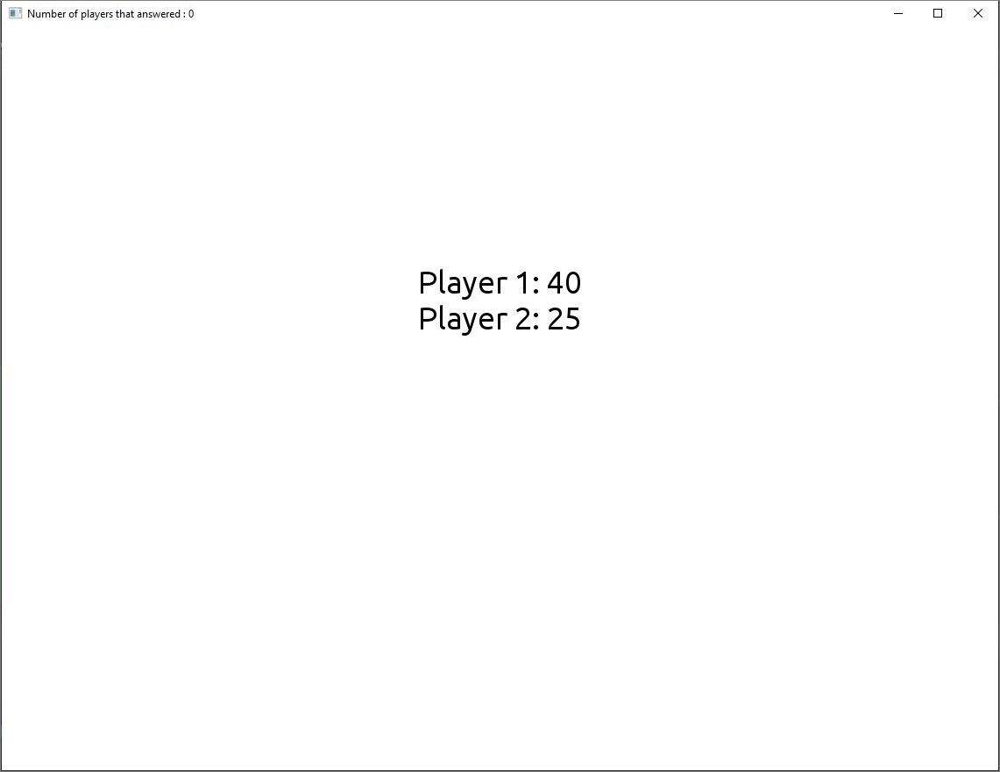

# SDL Custom Quizz Game

A custom quizz game made in C++ with [SDL](https://www.libsdl.org/) (used on [POSTAL 2](https://store.steampowered.com/agecheck/app/223470/) 🥛🔫) that uses the famous Buzz controllers from Playstation 2.

The questions are loaded from an .xml file on `SDL_custom_quizz_game/data/xml/Questions/`,  you can configure the correct answer as follows :

	<Question Type="1">
		<QuestionText>Select answer A !</QuestionText>
		<AnswerA>A</AnswerA>
		<AnswerB>B</AnswerB>
		<AnswerC>C</AnswerC>
		<AnswerD>D</AnswerD>
		<CorrectAnswer>A</CorrectAnswer>
	</Question>
	
Used game state machine to control game flow.
Used a internal logger to log all activity to a log file.

## Screenshots

## Instructions

1. Install [Visual Studio](https://visualstudio.microsoft.com/). The free Community edition will work perfectly.
2. Download/clone the project from this repo.
3. Load it into Visual Studio (You can double-click on SDL_custom_quizz_game.sln)
4. Build and it and try it out!!!

**_Note_** : You don´t need buzz controllers connected to the PC in order to use the app, you can test it with keyboard.

